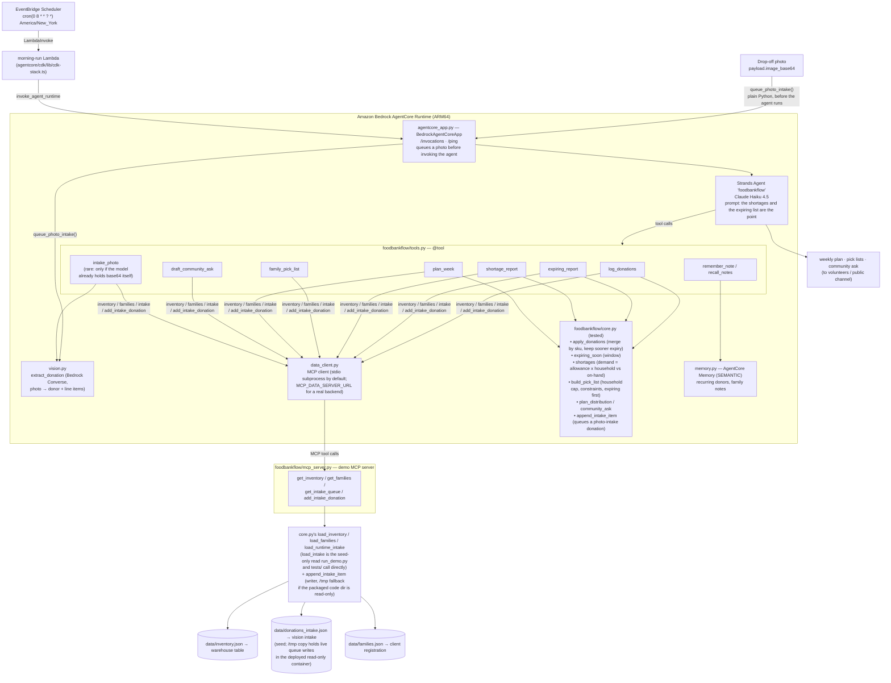

# FoodBankFlow — Architecture

## Overview

A **single Strands operations agent** over a deterministic inventory + allocation
core. The agent never counts stock or computes demand — it runs the plan and
writes the practical summary for a volunteer.

## Components

| File | Responsibility |
|---|---|
| `agentcore_app.py` | AgentCore Runtime contract. |
| `foodbankflow/agent.py` | System prompt: log, then expiring → shortages → surplus, then offer the ask and pick lists. |
| `foodbankflow/tools.py` | 12 `@tool` wrappers. Data comes from `data_client` (MCP); the math comes from `core`; the photo read comes from `vision`. Reports run on inventory + logged donations, so tools are idempotent. |
| `foodbankflow/vision.py` | **The PHOTO → vision step.** Reads a drop-off photo via Bedrock's Converse API (multimodal `MODEL_ID`) and returns donor + line items; `tools.py`'s `intake_photo` wraps it and queues the result through `data_client`. |
| `foodbankflow/data_client.py` | MCP client the live agent's tools use for inventory/families/intake, plus queuing a photo-intake donation. Spawns `mcp_server.py` over stdio by default; point `MCP_DATA_SERVER_URL` at a real backend instead — no other code changes. |
| `foodbankflow/mcp_server.py` | Demo MCP server (FastMCP). Exposes `get_inventory` / `get_families` / `get_intake_queue` / `add_intake_donation`, backed by `core.py` — a stand-in for the real warehouse/registration/vision-intake systems. |
| `foodbankflow/core.py` | **The math.** Donation merge, expiry, demand-vs-stock, constraint-aware allocation, ask text, plus the `load_inventory`/`load_families`/`load_intake`/`append_intake_item` seed-file readers+writer (used directly by `mcp_server.py`, `run_demo.py`, and the tests — not by `tools.py`). |
| `foodbankflow/memory.py` | Recurring donors, standing family notes — real AgentCore Memory (SEMANTIC strategy) when deployed, a local Markdown file otherwise. |
| `tests/test_core.py` | 11 tests: merge/expiry rules, the dairy shortage, produce surplus, gluten-free allocation, household caps, expiring-first, photo-intake queuing. |
| `tests/test_vision.py` | 4 tests for the vision step's JSON parsing (fences, bad/missing fields) — no model call. |
| `run_demo.py` | Offline weekly plan + community ask — reads `core.py` directly, never touches MCP, so it stays network-free. |
| `agentcore/cdk/lib/cdk-stack.ts` | **The SCHED → APP edge.** A CDK-managed Lambda (`invoke_agent_runtime` with the morning-plan prompt) plus an EventBridge Scheduler rule that triggers it daily at 8am America/New_York. |

## The allocation model (`core.py`)

- **Demand** per category = `per_person_per_cycle[cat] × Σ household_size` over
  the relevant families; infants add a hygiene unit.
- **`build_pick_list`** caps each category at `rate × household_size`, drops
  items banned by a family's constraints (`gluten_free` → no bread/pasta,
  `diabetic` → no bread, `no_pork` reserved for real data), and walks inventory
  **sorted by expiry** so the soonest-to-spoil goes out first.
- **`shortages`** reports a `deficit` where on-hand < demand, and `surplus` where
  on-hand exceeds a full extra cycle — the shareable stock.

## Data access (`data_client.py` / `mcp_server.py`)

The live agent's tools don't read the seed files directly - they go through
`data_client.py`, a Strands `MCPClient`, over the real Model Context Protocol
(not a mock). By default it spawns `mcp_server.py` as a stdio subprocess, so
there's nothing extra to deploy: it works identically whether run locally
(`make agent`) or inside the AgentCore Runtime container. `mcp_server.py`
itself just calls `core.py`'s existing `load_inventory`/`load_families`/
`load_intake` - so today it still serves the same JSON seed files, but that
process is a natural stand-in for the warehouse/inventory table,
client-registration system, and vision-intake step this would call against
in production. Swapping to a real backend is a one-line change: set
`MCP_DATA_SERVER_URL` to that backend's streamable-HTTP MCP endpoint;
nothing in `tools.py` or `core.py` needs to change.

`core.py`'s `load_*` readers stay in place and unchanged for a reason:
`run_demo.py` and `tests/test_core.py` call them directly, bypassing MCP
entirely, so the offline demo and the deterministic test suite stay
network-free regardless of whether an MCP server is reachable.

## How it meets the three hackathon requirements

| Requirement | Where |
|---|---|
| **Built with Strands Agents SDK** | `foodbankflow/agent.py` — `strands.Agent` + `@tool`. |
| **Routine/repetitive work for a group** | The weekly count-donations / check-expiry / project-demand / build-pick-lists cycle that one volunteer does by hand for every registered family. |
| **Deployable on Amazon Bedrock AgentCore** | `agentcore_app.py` + `DEPLOY.md`; morning cron + photo intake. |

## Model

`us.anthropic.claude-haiku-4-5-20251001-v1:0` (`MODEL_ID` override), temp 0.2.
