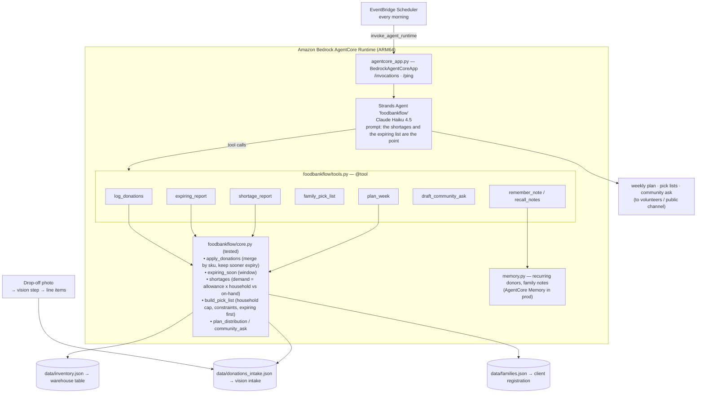

# FoodBankFlow — Architecture

## Overview

A **single Strands operations agent** over a deterministic inventory + allocation
core. The agent never counts stock or computes demand — it runs the plan and
writes the practical summary for a volunteer.

## Components

| File | Responsibility |
|---|---|
| `agentcore_app.py` | AgentCore Runtime contract. |
| `foodbankflow/agent.py` | System prompt: log, then expiring → shortages → surplus, then offer the ask and pick lists. |
| `foodbankflow/tools.py` | 11 `@tool` wrappers. Seed files immutable; reports run on inventory + logged donations. |
| `foodbankflow/core.py` | **The math.** Donation merge, expiry, demand-vs-stock, constraint-aware allocation, ask text. |
| `foodbankflow/memory.py` | Recurring donors, standing family notes. |
| `tests/test_core.py` | 10 tests: merge/expiry rules, the dairy shortage, produce surplus, gluten-free allocation, household caps, expiring-first. |
| `run_demo.py` | Offline weekly plan + community ask. |

## The allocation model (`core.py`)

- **Demand** per category = `per_person_per_cycle[cat] × Σ household_size` over
  the relevant families; infants add a hygiene unit.
- **`build_pick_list`** caps each category at `rate × household_size`, drops
  items banned by a family's constraints (`gluten_free` → no bread/pasta,
  `diabetic` → no bread, `no_pork` reserved for real data), and walks inventory
  **sorted by expiry** so the soonest-to-spoil goes out first.
- **`shortages`** reports a `deficit` where on-hand < demand, and `surplus` where
  on-hand exceeds a full extra cycle — the shareable stock.

## How it meets the three hackathon requirements

| Requirement | Where |
|---|---|
| **Built with Strands Agents SDK** | `foodbankflow/agent.py` — `strands.Agent` + `@tool`. |
| **Routine/repetitive work for a group** | The weekly count-donations / check-expiry / project-demand / build-pick-lists cycle that one volunteer does by hand for every registered family. |
| **Deployable on Amazon Bedrock AgentCore** | `agentcore_app.py` + `DEPLOY.md`; morning cron + photo intake. |

## Model

`us.anthropic.claude-haiku-4-5-20251001-v1:0` (`MODEL_ID` override), temp 0.2.
